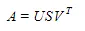

# Anime Recommender Using SVD
## Introduction
The world of anime is vast, offering a plethora of genres, styles, and stories that cater to a diverse audience. As the popularity of anime continues to grow, so does the need for efficient anime recommendation systems. An effective anime recommender can help users discover new series that align with their preferences, leading to increased user satisfaction and engagement. In this project, we aim to develop an Anime Recommender System using Singular Value Decomposition (SVD) on a rating system.

## Problem Statement
With the surge in global popularity of anime over the past two decades, numerous television stations and streaming services have acquired the rights to broadcast and feature anime content. As a streaming service dedicated exclusively to anime with a vast catalog of hundreds of titles, our primary objective is to cater to the diverse tastes of anime enthusiasts. However, in order to retain and engage users effectively, we face the following challenges:

1. User Engagement and Retention: To ensure the continued success of our anime streaming service, it is crucial to not only attract users but also retain them over time. Engaging users with content that resonates with their individual preferences is vital for achieving this goal.

2. Content Personalization: Our platform must provide personalized recommendations to each user. As anime genres and themes vary widely, creating a personalized experience can significantly enhance user satisfaction and encourage longer-term subscriptions.

## Project objectives
To address these challenges, we propose the development of a recommender system utilizing Singular Value Decomposition (SVD) techniques. This system will analyze user interactions with anime content, including viewing history, ratings, and user profiles, to generate tailored anime recommendations. By leveraging SVD, we aim to provide our users with a curated viewing experience that aligns with their unique preferences, ultimately increasing user retention and satisfaction on our platform.

The primary goal of this project is to create a personalized anime recommendation system using collaborative filtering that suggests relevant anime titles to users based on their previous ratings and preferences. To achieve this, we will utilize a collaborative filtering approach, specifically employing Singular Value Decomposition (SVD) to extract latent factors from the user-item interaction matrix.

## Data Collection
To build the recommender system, we will need a sizable dataset containing user ratings for various anime series. Several online anime databases and platforms host user reviews and ratings. The most suitable dataset will include user ratings for a significant number of anime titles, along with user identifiers and anime identifiers. Datasets contains two set of data, rating.csv (user_id, anime_id and rating) and anime.csv (anime_id,name,genre,type,episodes,rating,members). The datasets were downloaded from Kaggle : https://www.kaggle.com/datasets/CooperUnion/anime-recommendations-database?select=anime.csv, where it's scrapped from myanimelist

## Model Used: Singular Value Decomposition (SVD)
Singular Value Decomposition (SVD) is a powerful matrix factorization technique used in various fields, including recommendation systems. It is particularly useful in identifying latent factors or hidden patterns within a user-item interaction matrix. In your case, this matrix represents user ratings for different anime titles.

The user-item interaction matrix is typically constructed with rows representing users and columns representing items (in this context, anime titles). The elements of this matrix correspond to user ratings for specific anime titles. Here's a simplified representation of this matrix:

        item id 1| item id 2 | item id 3 | item id 4 | item id 5
|user 1 rating   | ------    | rating    | rating    | --------
|user 2 rating   | rating    | ------    | rating    | rating
|user 3 -----    | ------    | rating    | rating    | --------
|user 4 -----    | ------    | ratimg    | ------    | rating

In the matrix above, "Rating" represents the user's rating for a specific anime title, while "----" indicates that the user has not rated that particular anime.

SVD decomposes this user-item interaction matrix into three separate matrices: U (user matrix), Σ (diagonal matrix containing singular values), and V (item matrix). Here's what each of these matrices represents:

U (User Matrix): This matrix represents users in a lower-dimensional space. Each row of U corresponds to a user, and the columns represent latent factors that capture user preferences. These latent factors are derived from the factorization of the original high-dimensional user-item-rating matrix.

Σ (Diagonal Matrix): Σ contains the singular values along its diagonal. These singular values represent the importance or weight of each latent factor in explaining the variance in the original user-item matrix. Larger singular values correspond to more significant factors.

V (Item Matrix): Similar to U, V represents items (anime titles) in a lower-dimensional space. Each row of V corresponds to an anime title, and the columns represent latent factors that capture item characteristics and features.

    ---------------------------------
    row=rating_data['user_id'].values
    col=rating_data['anime_id'].values
    data=rating_data['rating'].values
    ---------------------------------
Training an SVD-based recommendation system involves decomposing the user-item interaction matrix into three matrices (U, Σ, and V) using a mathematical technique called Singular Value Decomposition. Here's a step-by-step explanation of how the SVD model is trained:

1. Data Preparation:

Gather a dataset that contains user-item interactions, such as user ratings for anime titles. This dataset should be organized in a way that you can create a user-item interaction matrix, where rows represent users, columns represent items (anime titles), and the matrix elements represent user ratings.
Matrix Construction:

2. Create the user-item interaction matrix from your dataset. This matrix will be sparse since not all users have rated all items. The code snippet you provided earlier is crucial for constructing this matrix, where you collect user IDs, anime IDs, and corresponding ratings.
Mean Centering:

3. Subtract the mean rating of each user (row-wise) from their respective ratings. This step helps remove user-specific biases from the ratings.
Singular Value Decomposition (SVD):

4. Apply SVD to the mean-centered user-item interaction matrix. SVD factorizes this matrix into three matrices: U, Σ, and V.
U (User Matrix) represents users in a lower-dimensional space, where each row captures user preferences.
Σ (Diagonal Matrix) contains singular values along its diagonal, representing the importance of each latent factor.
V (Item Matrix) represents items in a lower-dimensional space, where each row captures item characteristics.
Matrix Dimension Reduction:

5. To reduce the dimensionality of the matrices U, Σ, and V, you can keep only the top-k singular values and their corresponding columns in U and V. This step helps retain the most significant latent factors while reducing noise and computational complexity.
Matrix Reconstruction:

6. Reconstruct the user-item interaction matrix by multiplying the reduced U, Σ, and V matrices. This reconstructed matrix represents predicted ratings for all user-item pairs.
Recommendation Generation:

7. To generate recommendations for a user, select the row corresponding to that user from the reconstructed matrix. The values in this row represent predicted ratings for all items.
Sort the items by their predicted ratings and recommend the top-N items with the highest predicted ratings to the user.
Evaluation:

8. Assess the model's performance using evaluation metrics such as Mean Squared Error (MSE), Root Mean Squared Error (RMSE), or others, to measure how well the predicted ratings match the actual user ratings in your dataset.
You may also employ techniques like cross-validation to ensure the model's generalization performance.
Hyperparameter Tuning:

9. Experiment with hyperparameters such as the number of latent factors (k), learning rate, regularization terms, and others to optimize the model's performance.

10. Prediction
After training your SVD-based recommendation model, you can use it to make predictions for a specific user.
Select a user by their user ID for whom you want to generate recommendations.
For this user, calculate the predicted ratings for all items (anime titles) that they have not yet rated.
Rank the items based on these predicted ratings in descending order to identify the top-K items with the highest predicted ratings.
You can decide the value of K based on your preference or application requirements (e.g., top 3, 5, or 10 recommendations).
These predicted ratings essentially represent the likelihood or probability that the user will rate each item positively, allowing you to recommend the top-K items with the highest predicted likelihood of user engagement or interest.

    
## Deployment Using Streamlit Hosted on Hugging Face
Since the trained model and dataset are quite large (more than 100 MB), for the main source code is pushed to github, while the complete file and source code can be found in dagshub with this address:
dagshub address: https://dagshub.com/rachmanto.rian/anime-recommender-svd

and the the project is being deployed  using streamlit while hosted on Huggingface

Huggingface address: https://huggingface.co/spaces/Rianknow/anime-rec

